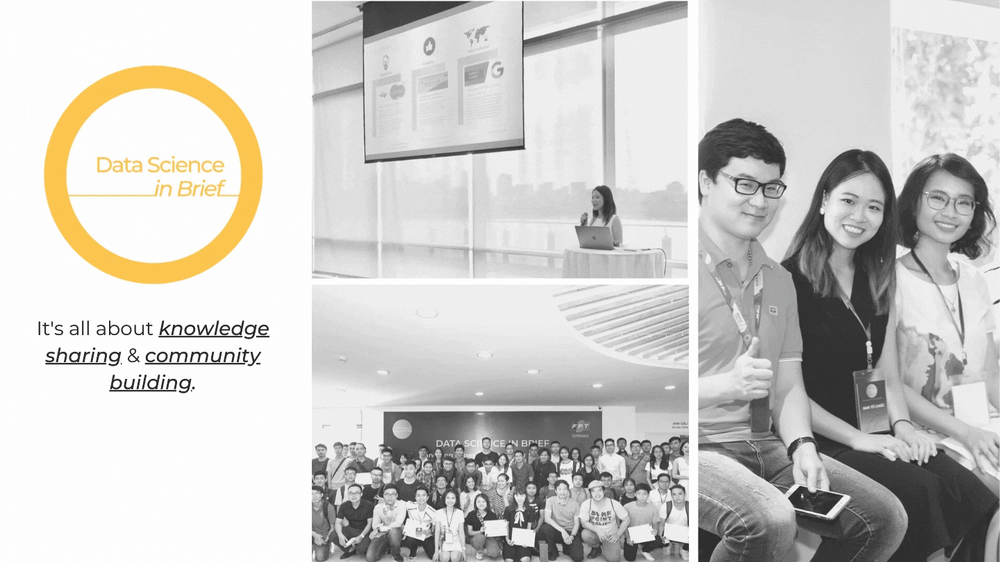

 
I am Emmy Phung, a Machine Learning Engineer currently pursuing an **MS in Data Science at NYU**. I have research and industry experience in machine learning, deep learning, natural language processing (NLP), probabilistic time series and recommender system.

I love working in teams, tackling new data challenges as well as seeking original approaches to existing problems. I have just finished my **Data Science & Optimization internship** with **ATIM** (Advanced Technologies for Investment Management) at **Fidelity Investments**, in which I proposed a deep learning approach to a conventional time series modelling problem and enabled the team to first time ever simulate market volatitlity over a long time horizon (10 years+) using a Long Short-Term Memory (LSTM) model with auto-encoder deployed on AWS Sagemaker. I also helped the team eliminate the manual data-cleansing process in Excel and enhance data quality by automating the imputation process using multiple chained equations (MICE framework) in Python. 

Graduating soon, I aspire to turn ideas into actionable solutions and unlock new potentials from data with my solid programming skills and theoretical knowledge in data science. Check out my portfolio by clicking on the red button below!  

 

 

 
I also have a passion for knowledge sharing and community building. With a hope to share my learning journey with others and support the data science community in Vietnam, I have founded and am managing **Data Science in Brief** (DSinbrief), a science page and an online community that connects data science enthusiasts, learners and practitioners. DSinbrief is initiating an effort in connecting and strengthening the data science community in Vietnam, which has remained a challenge to current institutes, training agencies and even big companies. 

Within a year, I've grown a team of 20 young data scientists as well as hosted 2 data science conference that welcomed 146 attendees (full-day event), 615 live viewers (4 online workshops across 2 days), and nearly 20 guest speakers from major tech companies like Apple, Microsoft, Google, Airbnb, Salesforce, Etsy, VinBrain, etc.

Click the blue button below to hear my story!
 

