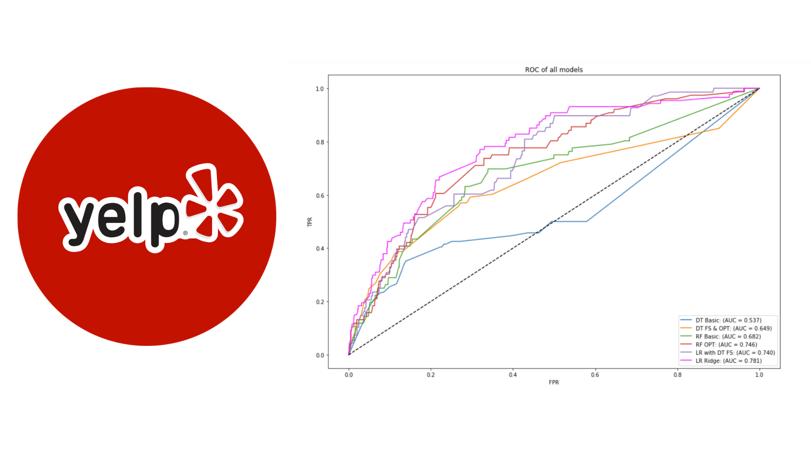
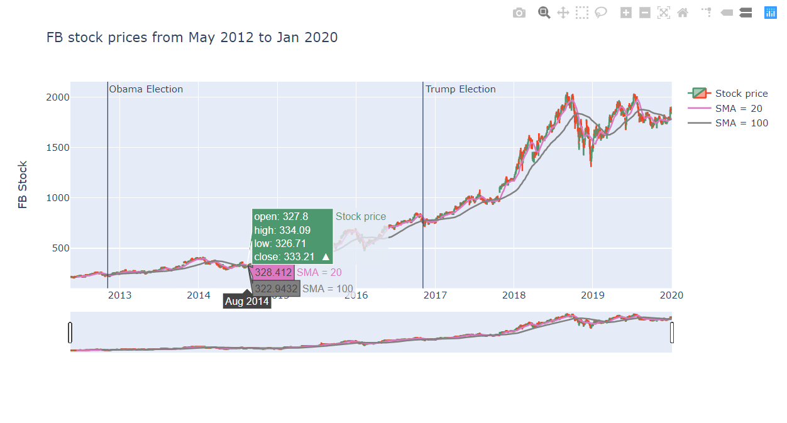
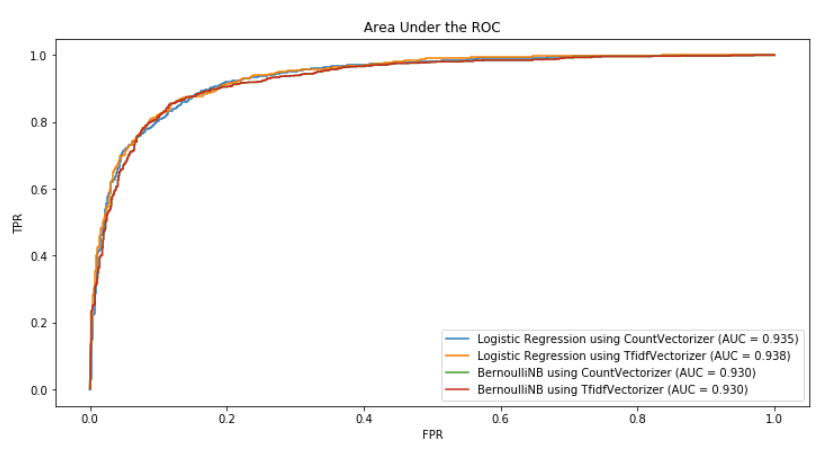
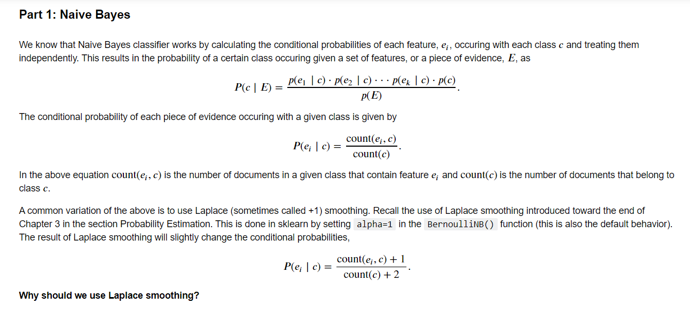
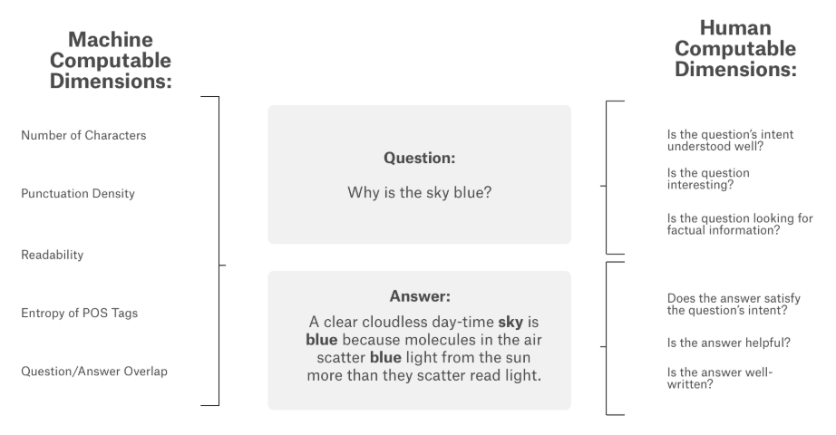
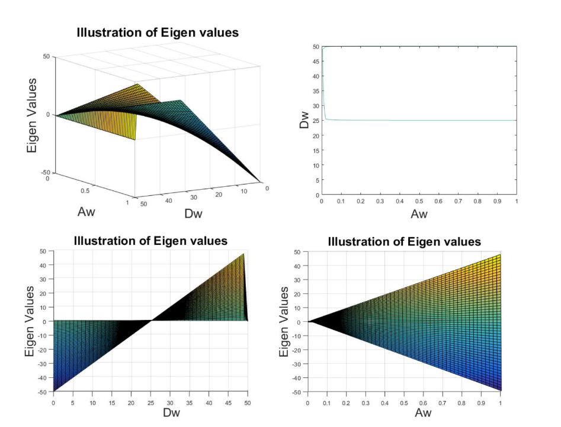

# Portfolio
---
## Data Science

[**Food Happens in Vegas: How can restaurants improve their Yelp profiles for success?**](https://github.com/Emmyphung/Vegas_foodies)

The purpose of this data mining project is to examine how restaurants can improve their Yelp profile to become more “successful” on Yelp in Las Vegas, Nevada.

Differently from the traditional approaches to this dataset, our methodology defines “success” as a binary variable through an exploratory analysis of the restaurants’ review counts and ratings on Yelp. Feature variables include categories and attributes that Yelp users can use to select which restaurant to visit. For this project, we ran Decision Tree, Random Forest, and Logistic Regression to explore key features associated with “success” and obtain recommendations for restaurants to improve their Yelp profile. Final results indicate that determinants of success vary by cuisine type.
 
Finally, I created recommender system that restaurant owners can use to study their top competitors. Given the name of the restaurant and the cuisine, the system will output top 10 competitors of that restaurant based on their similarities in attributes.
 
**Models**: Decision Tree, Random Forest, and Logistic Regression. 

---
[**Effects of US Presidential Elections on the stock market: a close look into the Tech sector**](https://github.com/Emmyphung/FAANG_stockprices)

 This project analyzes stock prices of big tech companies, Facebook - Apple - Amazon - Netflix - Google (FAANG) and sees how they progressed throughout the two recent presidential election (2012 - Barack Obama and 2017 - Donald Trump).
 
Some interesting findings:
1. Overall, stocks within the FAANG companies are closely correlated. Facebook stocks and Google stocks are the most correlated.
2. Facebook and Google stocks were the most volatile in 2018, which was also the year when Facebook had its infamous scandal with Cambridge Analytica.
3. Facebook and Netflix stocks have the highest prices throughout both election periods.
4. Several tech stocks rocketed after Trump's elecion in 2017.
5. Facebook stock price is almost always increasing. The second notebook shows a 2-year projected growth of Facebook's stocks.
 
**Models**: Auto-regressive (AR), Moving average (MA), ARIMA (Autoregression integrated with moving-average) model.

 

 

---
## Natural Language Processing

[**Sentiment Analysis on Movie Reviews: Logistic Regression vs. Naive Bayes Bernoulli**](https://github.com/Emmyphung/Sentiment-Analysis)

This notebook will compare the performance of two NLP techniques, Count Vectorizor and TF-IDF Vectorizer, and two classification models, Logistic Regression and Bernoulli Naive Bayes in sentiment analysis. I'll give detailed explanation on which model performs better and why.

 

 

---
[**Kaggle Competition: Google QUEST Q&A Labelling**](https://github.com/JasonZhangzy1757/Kaggle_Google_QUEST_QA_Labeling)

 Google Q&A Labelling is a classification problem. Given pairs of questions and answers, we are asked to classify the question types, answer types, level of helpfulness of the answers, etc. For this project, I conducted comprehensive EDA to understand the datasets and important variables, used Multilabel Stratified KFolds to solve class imbalance issue, and used BERT pretuned models to solve the classification problems.

 

 

---
## Math Modelling

[**Projected growth of Neurendocrine cells using Matlab**](https://github.com/Emmyphung/Neurendocrine-cells)

The project aims at tracking the three phase transformation of neuroendocrine cells specific to the human colon, which is illustrated in the figure below. A stem cell transforms into a progenitor cell and finally a mature cell through symmetric and asymmetric cell division. Symmetric cell division, also known as self-renewal, occurs when a stem cell divides symmetrically into two identical stem cells. Asymmetric cell division characterizes the maturation process when a stem cell divides into a stem cell and a progenitor cell, or a progenitor cell divides into a progenitor cell and a mature cell. In each phase, cells also experience apoptosis. meaning cell death. With an aim to capture this phenomenon, I want to build a model that track the number of cells in each phase, stem cells, progenitor cells and mature cells.

---
## Data Science in Brief (Facebook Page & Group)

Data Science in Brief is an international organization, a learning community that aims at 1) sharing knowledge to inspire young learners and to keep experienced scientists updated with state-of-the-art practices & applications; and 2) connecting young Data Science enthusiasts – learners – practitioners with leading experts in the field for learning and career opportunities
 
• Reached 11,000 readers within the 1st month (organically)  
• Organized Data Science in Brief: Hands-on Experience & Career Navigation (VN, 2019), a full-day conference that welcomed 146 attendees and 10 guest speakers from giant tech companies (Google, Hitachi, FPT Worldwide) and top universities (Johns Hopkins, NYU, etc.)

 
---

© 2020 My (Emmy) Phung. Powered by Jekyll and the Minimal Theme.

